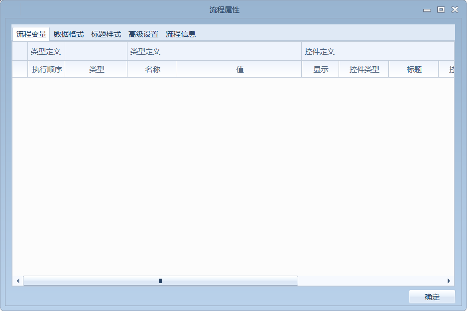
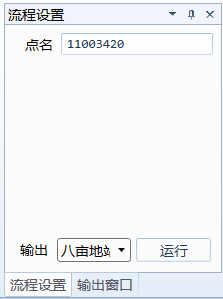
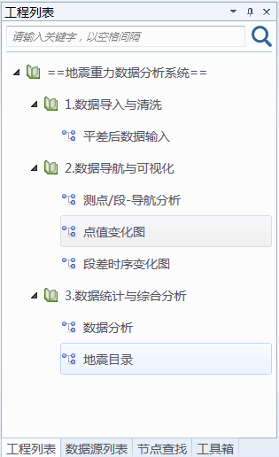
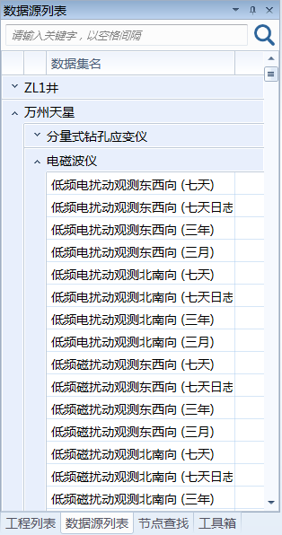
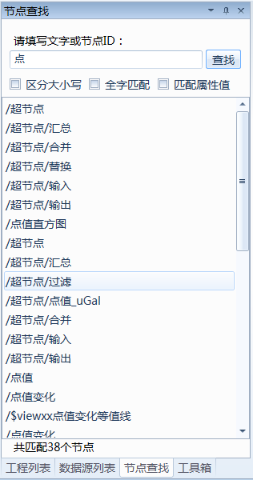
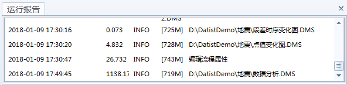

.. the frist doc for datist

Hello world！
=====================
典型的 Datist 界面如下：

.. figure:: images/first01.png
     :align: center
     :figwidth: 100% 
     :name: plate 

接下来将详细介绍其基本概念与操作。

**基本概念：节点**

节点代表要对数据执行的操作。

例如，假定您需要打开某个数据源、添加新字段、根据新字段中的值选择记录，然后在表中显示结果。在这种情况下，您的数据流应由以下四个节点组成：

.. figure:: images/first02.png
     :align: center
     :figwidth: 100% 
     :name: plate 	 
	 
**基本概念：数据流**

使用 Datist 进行数据处理是采用一系列节点分析数据的过程，我们将这一过程称为数据流。也可以说 Datist 是以数据流为驱动的工具，这一系列节点代表要对数据执行的操作，而节点之间的链接指示数据流动的方向。例如，上面提到的四个节点可以创建如下数据流：

.. figure:: images/first03.png
     :align: center
     :figwidth: 100% 
     :name: plate 	 
 
通常，Datist 将数据以一条条记录的形式读入，然后对数据进行一系列操作，最后将其发送至某个地方（可以是算法或某种格式的数据输出）。使用 Datist 处理数据的三个步骤：

#. 将数据读入 Datist。
#. 通过一系列操作分析数据。
#. 将数据发送到目标位置。

**工具箱选项卡**

工具箱选项卡位于流工作区左侧窗口中。

.. figure:: images/first05.png
     :align: center
     :figwidth: 100% 
     :name: plate 	 

工具箱选项卡中包含多个工具栏，每个工具栏中均包含一组不同数据分析阶段使用相关节点，如：
 
* **数据源：** 此类节点可将数据导入 Datist，如数据库、文本文件、Excel、Word、扫描目录等。
* **行列计算：** 此类节点可对数据进行行列操作，如选择、过滤、新列、合并和追加等。
* **空间分析：** 此类节点提供空间分析方法，如投影变换、图元信息提取、图元简化与平滑等。
* **高级计算：** 此类点提供基于文件级数据处理方法，如文件格式变换、文件操作等。
* **数据库与数据质量：** 此类点提供基于数据库的质量分析方法，如数据表计数、数据库抽样、字段名匹配等。
* **经典算法：** 此类节点可使用 Datist 中提供的建模算法，如神经网络、决策树、聚类算法和回归等。
* **数据可视化：** 此类节点以图表形式显示数据，包括散点图、直方图、地理图和地质图版等。
* **报告与软件接口：** 将可数据格式化生成特定格式的报告，或用 R、Python 等高级语言对 Datist 功能进行扩展，如Excel报告、Html报告、C#扩展、R扩展等。
* **数据发布：** 此节点用于保存数据、在线发布数据，如写入数据库、发微信、发邮件等。
* **运行控制：** 提供一组控制流程运行方式的节点，如更新变量、流程调试、文件收集器、顺序运行器等。
* **扩展工具：** 为高级用户提供自定义节点入口，以便您将扩展节点添加至其中。
* **场景设计：** 提供一套矢量化的图标，用于装饰流程场景，表达流程的用途。

随着对 Datist 的熟悉，您可以把常用节点添加至收藏夹栏中，或是编写您自己的节点。

**使用节点和流**

要将节点添加到工作区，请在节点选项板中双击图标或将其拖放到工作区。

Datist 中最常见的鼠标用法如下：

* 单击。使用右键选择菜单选项，打开右键菜单；在流工作区空白处单击并按住可以框选多个节点；单击节点并按住按键可拖动节点。
* 双击。双击鼠标左键可将节点置于流工作区，或打开节点的编辑器。
* 中键。在节点上按住中键并拖至其它节点上放下，以建立节点之间的连接关系。如果没有三键鼠标，可通过按 Ctrl + 左键来模拟此功能。

.. note::
  在多次框选节点过程中，默认情况下，是清除原有节点的选中状态，将选择框中的节点置于选中状态；您可以按下Ctrl键，框选未选中节点以增加选中节点的个数；或是按住Alt键，框选已选中节点以减少选中节点的个数。

  您可以从Windows的文件夹中把文件或目录，拖到或是复制、粘贴到 Datist 的流工作区，系统将根据文件类型自动创建数据源节点。系统支持.mdb .db .db3 .accdb .xls .xlsx .csv .txt .doc .docx .wis .e2d .dxf .kml .shp .gdb .png .jpg .dms等。
   
创建了流以后，可以对流进行保存、添加注解，或是添加到工程。在流工作区的右键菜单中使用流程属性功能，打开流程属性窗口，您可以编辑流程的基本信息、添加流程变量、设置数据的默认输出格式、多级标题的编号样式以及流程的运行方式;流程属性窗口如下：

	 
**Datist管理器**
 
“已打开流程”选项卡中，管理着当前打开数据流程，可以使用“已打开流程”选项卡新建、打开、保存或关闭流程。

.. figure:: images/first04.png
     :align: center
     :figwidth: 100% 
     :name: plate 	 
 
“输出窗口”选项卡中，管理由 Datist 中流程操作生成的输出或图形文件，您可以显示、锁定和关闭其中罗列的输出窗口。
 
.. figure:: images/first06.png
     :align: center
     :figwidth: 100% 
     :name: plate 	 
 
“流程设置”选项卡中，管理当前流程中使用的流程变量，您可以给流程变量的赋值并运行指定的输出节点。
 

 
“工程列表”选项卡，对流程工程管理，您可以将一组相关的流程组织成工程，从而形成整体的解决方案。
 

	 
“数据源列表”选项卡，管理数据库中的数据表或视图，以便于快速创建数据访问流程；您可以通过数据字典将企业中的多个数据库添加其中。
 

	 
“节点查找”选项卡，可以用于查找当前流程中节点或是参数，以便于您查找并定位节点。
 

“运行报告”选项卡，管理由 Datist 流程操作与运行产生的日志，您可以用它来排查运行过程中出现问题。
 
