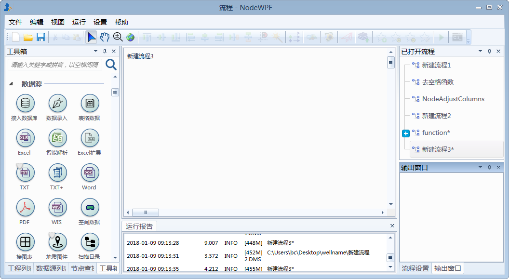
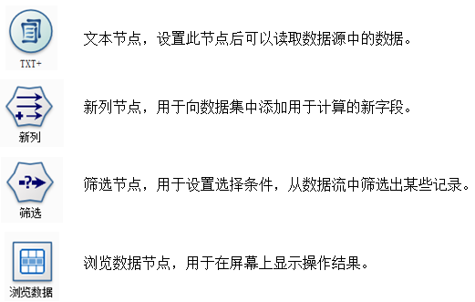
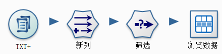
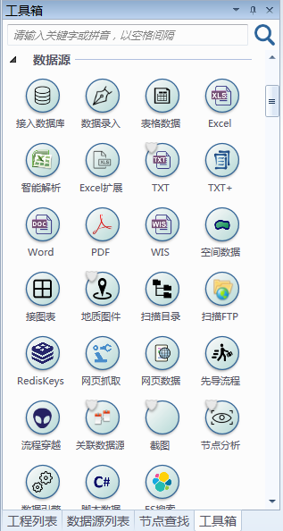
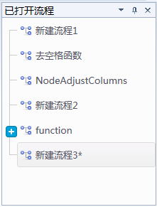
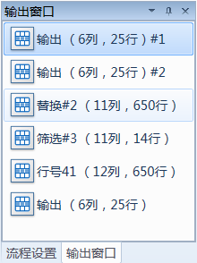

.. the frist doc for datist

Hollow world！
=====================
典型的 Datist 界面如下：

接下来将详细介绍其基本概念及操作。

**基本概念：节点**

节点代表要对数据执行的操作。

例如，假定您需要打开某个数据源、添加新字段、根据新字段中的值选择记录，然后在表中显示结果。在这种情况下，您的数据流应由以下四个节点组成：

	 
**基本概念：数据流**

Datist 进行的数据处理重点关注通过一系列节点运行数据的过程，我们将这一过程称为数据流。也可以说 Datist 是以数据流为驱动的工具，这一系列节点代表要对数据执行的操作，而节点之间的链接指示数据的流动方向。如，上面提到的四个节点可以创建如下数据流：

 
通常，Datist 将数据以一条条记录的形式读入，然后通过对数据进行一系列操作，最后将其发送至某个地方（可以是模型，或某种格式的数据输出）。使用 Datist 处理数据的三个步骤：

#. 将数据读入 Datist。
#. 通过一系列操纵运行数据。
#. 将数据发送到目标位置。

**工具箱选项板**

工具箱选项板位于流工作区左侧窗口中。

每个选项板选项卡均包含一组不同的流操作阶段中使用的相关节点，如：
 
* **数据源：** 此类节点可将数据导入 Datist，如数据库、文本文件、Excel、Word、扫描目录等。
* **行列计算：** 此类节点可对数据行列操作，如选择、过滤、新列、合并和追加等。
* **空间分析：** 此类节点提供空间分析方法，如投影变换、图元信息提取、图元简化与平滑等。
* **高级计算：** 此类点提供基于文件级数据处理方法，如文件格式变换、文件操作等。
* **数据库与数据质量：** 此类点提供基于数据库质量分析的方法，如数据表计数、数据库抽样、字段名匹配等。
* **经典算法：** 此类节点可使用 Datist 中提供的建模算法，如神经网络、决策树、聚类算法和回归等。
* **数据可视化：** 此类节点以图表形式显示数据，包括散点图、直方图、地理图和地质图版等。
* **报告与软件接口：** 此类节点可数据将格式化生成报告，用R、Python等语言对 Datist 功能进行扩展，如Excel报告、Html报告、C#扩展、R扩展等。
* **数据发布：** 此节点生成数据、存储数据、在线发布，如写入数据库、发微信、发邮件等。
* **运行控制：** 提供一组控制流程运行方式的节点，如更新变量、流程调试、文件收集器等。
* **扩展工具：** 提供用户自定义自已的节点，扩展系统的功能。
* **场景设计：** 提供一套矢量化的图标，用于装饰流程场景。

随着对 Datist 的熟悉，您可以在收藏夹栏中自定义常用节点，或是扩展自己的节点。

**使用节点和流**

要将节点添加到工作区，请在节点选项板中双击图标或将其拖放到工作区。已添加到流工作区的节点在连接之前不会形成数据流，可以将各个图标连接以创建一个表示数据流动的流，节点之间的连接指示数据从一项操作流向下一项操作的方向。

Datist 中最常见的鼠标用法如下所示：

* 单击。使用鼠标左键或右键选择菜单选项，打开上下文相关菜单以及访问其他各种标准控件和选项。单击节点并按住按键可拖动节点。
* 双击。双击鼠标左键可将节点置于流工作区，编辑工作区现有节点。
* 中键单击。单击鼠标中键并拖动光标可在流工作区中连接节点。双击鼠标中键可断开某个节点的连接。如果没有三键鼠标，可在单击并拖动鼠标时通过按 Ctrl 键来模拟此功能。

创建了流以后，可以对流进行保存、添加注解，将其添加到工程。从文件主菜单中，选择流属性还可以为流设置各种选项，如优化、日期和时间设置、参数。

.. note::
  您可以从Windows的文件夹中把文件或目录，拖到或是复制、粘贴到 Datist 的流工作区，系统将根据文件类型自动创建数据源节点。系统支持.mdb .db .db3 .accdb .xls .xlsx .csv .txt .doc .docx .wis .e2d .dxf .kml .shp .gdb .png .jpg .dms等。

**Datist管理器**
 
“已打开流程”选项卡中管理打开的多个数据流。可以使用“已打开流程”选项卡新建、打开、保存和关闭流程。

 
“输出窗口”选项卡中管理由 Datist 中的流操作生成的输出或图形文件。您可以显示、锁定和关闭此选项上列出的表格、图形和报告。
 

 

 
 