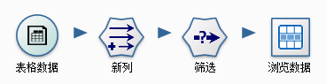

.. the frist doc for datist

Hollow world！
=====================
 典型的 Datist 界面如下：

接下来将详细介绍其基本概念及操作。

**基本概念：节点**

节点代表要对数据执行的操作。

例如，假定您需要打开某个数据源、添加新字段、根据新字段中的值选择记录，然后在表中显示结果。在这种情况下，您的数据流应由以下四个节点组成：

.. figure:: images/first_02.png
     :align: center
     :figwidth: 60% 
     :name: plate 	 
	 

**基本概念：数据流**

 Datist 进行的数据处理重点关注通过一系列节点运行数据的过程，我们将这一过程称为数据流。也可以说 Datist 是以数据流为驱动的工具，这一系列节点代表要对数据执行的操作，而节点之间的链接指示数据的流动方向。如，上面提到的四个节点可以创建如下数据流：

 
 通常，Datist 将数据以一条条记录的形式读入，然后通过对数据进行一系列操作，最后将其发送至某个地方（可以是模型，或某种格式的数据输出）。使用 Datist 处理数据的三个步骤：

#. 将数据读入 Datist。
#. 通过一系列操纵运行数据。
#. 将数据发送到目标位置。

