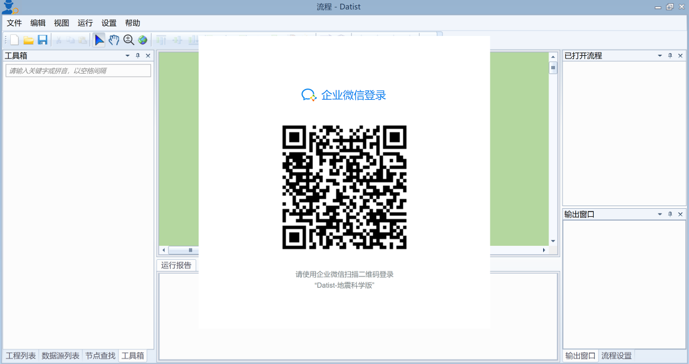
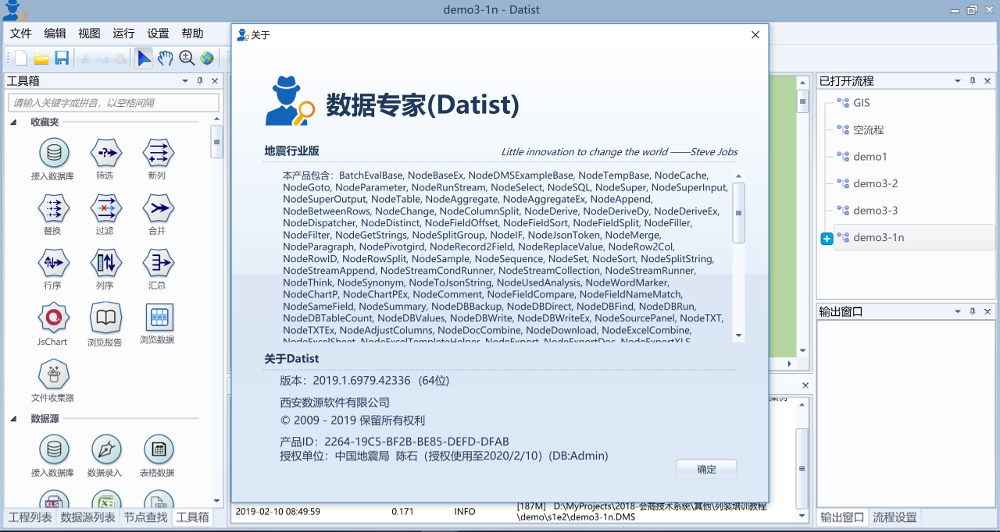

.. Datist documentation master file, created by
   sphinx-quickstart on Sun Jan 7 22:11:51 2018.
   You can adapt this file completely to your liking, but it should at least
   contain the root `toctree` directive.
   
相关视频
====================================
.. toctree::
   :maxdepth: 2
   :numbered:
 
第一季 数据专家地震科学版（DatistEQ）
------------------------------------

特邀中国地震局地球物理研究员陈石博士，结合我国地震行业的分析会商的现状，通过大数据、云计算等最先进的技术，最大限度地解耦地震科研领域的科研工作，从而达到让科研有效率、数据更智能的远景。第一季共分5集，从地震分析会商系统的顶层设计到企业业务流程重构、从数据专家的基础操作到集群化部署应用，从科研人员个人的软件开发到团队协作与可持续性集成、从宏观布局到具体实施落地，视频制作精良、内容详实、语言优美，娓娓道来地震科研系统走向智能化的奥秘，带我们走进神奇的地震科研世界。 

Datist地震科学版是经过17-18年两年的实践积累，由地震会商技术系统项目组和长安大学专门为地震行业数据分析而研发的一个独立产品，凡是在地震科研助手微信企业号中的成员，下载安装包后，都可以通过扫描二维码的方式，自动获得授权文件，免费使用。

数据专家的基本原理就是把数据处理过程中涉及的处理方法抽象成一个个的节点之间的连接网络，来解决业务系统构建中的各种问题。而Datist地震科学版为行业用户提供了一个开放的平台，允许用户自定义组建自己的数据处理系统，完成特定的数据分析、处理任务。

数据专家地震科学版（ `下载地址 <https://datist-download.oss-cn-beijing.aliyuncs.com/2019/Datist%202019.1%20Setup.exe>`_ ）特点：

   * 针对地震行业特点，进行多项针对性的优化；

   * 支持自定义节点开发，方便扩展；

   * 支持微信扫描二维码自动授权模式；

   * 优化编译程序和系统设置，启动和运行速度加快；

   * 优化后的绘图、GIS插件；

   * 新增地震行业常用矢量底图数据。
 
安装步骤：

第一步：下载后安装，第一次登陆，请打开企业微信进入“地震科研助手”，通过扫描二维码自动获取授权文件

第二步：进入程序界面后，进入“帮助”菜单，点击“关于”，授权信息如下图所示

 
 
1、地震分析会商技术系统是什么
^^^^^^^^^^^^^^^^^^^^^^^^^^^^^^^^^^^^
 
*要点提示：*

   地震分析会商系统的缘起、设计、定位、组成和特点；一些资源获取方法和学习方式

*知识点：* 

   * 地震信息化的核心是业务信息化

   * 去中心化的运行理念

   * 宽平台、厚技术、微应用

*内容：* 

   * 难度：容易
   
   * 时长：30分钟
   
   * 对象：列装单位的负责人和业务人员
 
*视频链接：*

   `ispec20190203 <https://igp-gravity.github.io/2019/02/03/ispec20190203.html>`_ 

   
2、如何设计你自己的工作流程
^^^^^^^^^^^^^^^^^^^^^^^^^^^^^^^^^^^^
 
*要点提示：* 

   * 流程体系与工作流编辑器，Datist数据科学版获取、安装和环境特点；
   
   * 常用节点介绍；
   
   * 应用场景（数据绘图与可视化、数据统计与预处理、GIS与地震目录分析）。

*内容：* 

   * 难度：容易
   
   * 时长：40分钟
   
   * 对象：列装单位的负责人和业务人员
   
*视频链接：*  

   `ispec20190207 <https://igp-gravity.github.io/2019/02/07/ispec20190207.html>`_ 

   
3、让流程开始工作的方法
^^^^^^^^^^^^^^^^^^^^^^^^^^^^^^^^^^^^   
 
*要点提示：*

   * 地震目录的分析方法；
   
   * GIS与空间分析功能、底图的配置与修改；
   
   * 节点案例与流程商店；

*内容：*

   * 难度：一般
   
   * 时长：45分钟
   
   * 对象：列装单位的负责人和业务人员
   
*视频链接：*   

   `ispec20190208 <https://igp-gravity.github.io/2019/02/08/ispec20190208.html>`_ 
   
4、学会利用“轮子”来帮助你完成更多工作
^^^^^^^^^^^^^^^^^^^^^^^^^^^^^^^^^^^^      
 
*要点提示：*

   * 流程变量、eCharts与GMT6.0集成；
   
   * Python语言与自定义节点(前兆数据处理与曲线绘制)；
   
   * 自定义节点开发介绍；

*内容：*

   * 难度：较难
   
   * 时长：约50分钟
   
   * 对象：业务人员
   
*视频链接：*   

   `ispec20190209 <https://igp-gravity.github.io/2019/02/09/ispec20190209.html>`_ 
   
   
5、现代化软件开发与可持续的集成方法
^^^^^^^^^^^^^^^^^^^^^^^^^^^^^^^^^^^^      
 
*要点提示：*

   * DevOps开发理念vs瀑布式开发，敏捷式开发工具；
   
   * Python语言与Github仓库；
   
   * 地学家软件包计划，如何参与Geoist软件包开发；

*内容：*

   * 难度：一般
   
   * 时长：约35分钟
   
   * 对象：业务人员
   
*视频链接：*   

   `ispec20190210 <https://igp-gravity.github.io/2019/02/10/ispec20190210.html>`_    